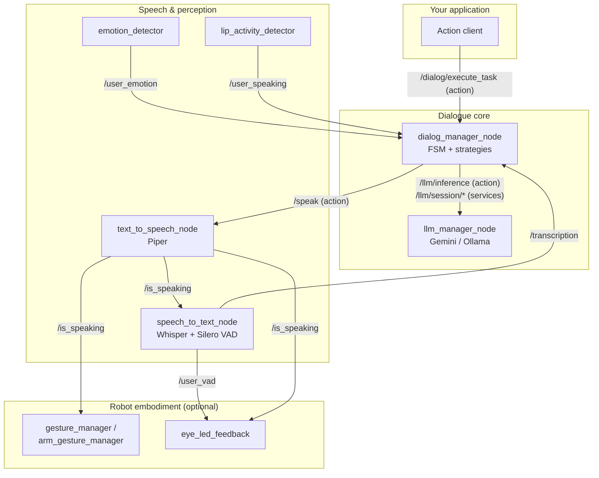

<p align="center">
  
</p>

<p align="center">
  <strong>LLM-powered spoken dialogue stack for ROS 2 robots</strong><br/>
  Task-oriented dialogue management, speech I/O and multimodal perception, with ready-to-use NAO support.
</p>

<p align="center">
  
  
  
  
  
</p>

---

DialoStack lets a robot hold **goal-driven spoken conversations**: collect structured data from a user, explain a topic and check understanding, or run an interactive quiz. It works entirely through voice, in any language, on any ROS 2 robot.

The core design principle is **deterministic control, probabilistic understanding**. The dialogue flow (states, phases, turn limits, cancellation, confirmation) is plain, testable Python. The LLM is consulted only for what it does well: understanding what the user said and phrasing the next reply. The behavior stays predictable and debuggable, and the conversation still feels natural.

## Features

- 🎯 **Task-oriented dialogue engine** with three pluggable strategies: **slot filling**, **explanation** and **quiz**, plus a registry to add your own.
- 🗣️ **Full speech pipeline**: faster-whisper + Silero VAD for STT, Piper for streaming TTS, with automatic self-muting so the robot never transcribes its own voice.
- 🧠 **Provider-agnostic LLM backend**: Google Gemini (cloud) or Ollama (local) behind one ROS interface, with isolated NLU/NLG sessions per dialogue.
- 👀 **Multimodal perception**: facial emotion recognition and lip-activity detection feed live user state into the dialogue context.
- 🤖 **Robot embodiment layer**: gestures, posture and eye-LED feedback for the SoftBank NAO, in simulation (RViz) and on the real robot. Other robots can slot in.
- 📊 **Evaluation suite**: five statistical benchmarks (precision/recall/F1, confusion matrices, end-to-end task completion) that run without ROS, against hand-annotated datasets.
- ✅ **173 unit tests** over the deterministic core. They run with plain `pytest`, no ROS required.

## Architecture



A dialogue turn runs as follows. The user speaks and `speech_to_text_node` publishes the transcription. The active **strategy** asks the LLM to interpret it (NLU), updates its state, then asks the LLM to phrase the reply (NLG). The reply is spoken through `/speak`, and `/is_speaking` mutes the microphone and drives gestures and LEDs. Emotion and lip activity stream in continuously and feed into the prompts as live context.

See **[docs/architecture.md](docs/architecture.md)** for the full design: node graph, dialogue FSM, strategy contracts, LLM session model and extension points.

## Repository layout

| Path | What it is |
|------|------------|
| [`ros2_dialog_manager/`](ros2_dialog_manager) | The dialogue engine: FSM, strategies, frame, prompt builder, LLM client |
| [`ros2_dialog_interfaces/`](ros2_dialog_interfaces) | Public API: `DialogTask` and `SpeakText` actions |
| [`ros2_llm_manager/`](ros2_llm_manager) | LLM backend node: providers, sessions, inference action |
| [`ros2_llm_interfaces/`](ros2_llm_interfaces) | `LlmInference` action and session services |
| [`speech_io/`](speech_io) | STT and TTS nodes |
| [`vision_io/`](vision_io) | Emotion and lip-activity detection nodes |
| [`robots/nao/`](robots/nao) | NAO-specific layer: URDF, gestures, eye LEDs, pose tooling |
| [`dialostack_bt_client/`](dialostack_bt_client) | BehaviorTree.CPP leaf node to run a dialogue from a behavior tree |
| [`evaluation/`](evaluation) | ROS-free benchmark suite with annotated datasets |
| [`docs/`](docs) | Architecture and configuration documentation |

## Getting started

### Prerequisites

- Ubuntu 24.04 with [ROS 2 Jazzy](https://docs.ros.org/en/jazzy/Installation.html)
- Python ≥ 3.10
- An LLM provider: a [Gemini API key](https://aistudio.google.com/apikey) (the free tier works) **or** a local [Ollama](https://ollama.com) install
- A microphone and speakers (any ALSA device)

### Install & build

```bash
mkdir -p ~/dialostack_ws/src && cd ~/dialostack_ws/src
git clone https://github.com/aquintan4/DialoStack.git
cd ..

# Python dependencies (faster-whisper, piper-tts, sounddevice, providers...)
pip install -r src/DialoStack/speech_io/requirements.txt
pip install -r src/DialoStack/ros2_llm_manager/config/requirements.txt
pip install -r src/DialoStack/vision_io/requirements.txt   # optional: vision nodes

colcon build --symlink-install
source install/setup.bash
```

> **Using a venv?** Sourcing the overlay reorders `PYTHONPATH` and hides the pip packages from the nodes. `activate.sh` fixes this. Open `src/DialoStack/activate.sh`, set the two variables at the top (your ROS distro and the venv path), then `source src/DialoStack/activate.sh` instead of `install/setup.bash` in every new terminal. It also exports `DIALOSTACK_MODELS_DIR`.

### Download the TTS voices

`text_to_speech_node` uses [Piper](https://github.com/rhasspy/piper) voices. One script fetches the default Spanish and English voices:

```bash
./src/DialoStack/scripts/download_models.sh
```

It downloads into `~/.local/share/dialostack/models` (override with `DIALOSTACK_MODELS_DIR`), where the nodes look by default. The shipped config references voices **by filename**, so you never edit a path. STT (faster-whisper) and the vision models download themselves on first run.

### Run the stack

```bash
export GEMINI_API_KEY="your-key"   # or enable Ollama in the config
ros2 launch ros2_dialog_manager main.launch.py
```

This brings up the four core nodes: STT, TTS, LLM manager and dialogue manager. Vision nodes and the robot layer are optional and launched separately.

## Your first dialogue

Everything goes through one action: **`/dialog/execute_task`**. Describe the task in natural language and the engine does the rest. It can even design the slot schema itself.

**Slot filling** collects structured data:

```bash
ros2 action send_goal --feedback /dialog/execute_task \
  ros2_dialog_interfaces/action/DialogTask \
  "{task_description: 'Take a coffee order: drink type, size and customer name',
    dialog_mode: 'slot_filling',
    domain: 'coffee shop'}"
```

The robot greets the user, asks for each missing slot, handles corrections ("actually, make it a large"), confirms the result, and returns the completed frame as JSON in `result.final_frame_json`. You can also supply your own schema (`frame_schema_json`) and pre-filled values (`initial_frame_json`) to resume an interrupted dialogue.

**Explanation** explains something and checks it was understood:

```bash
ros2 action send_goal /dialog/execute_task \
  ros2_dialog_interfaces/action/DialogTask \
  "{task_description: 'Explain the pre-surgery fasting instructions',
    dialog_mode: 'explanation',
    resources_json: '[{\"name\": \"instructions\", \"description\": \"fasting protocol\", \"content\": \"No food 8 hours before...\"}]',
    domain: 'hospital'}"
```

The engine explains, asks a comprehension question, answers follow-up questions, and rephrases (a bounded number of times) if the user did not understand.

**Quiz** runs interactive Q&A with scoring:

```bash
ros2 action send_goal /dialog/execute_task \
  ros2_dialog_interfaces/action/DialogTask \
  "{task_description: 'Run a short geography quiz',
    dialog_mode: 'quiz',
    resources_json: '[{\"name\": \"questions\", \"description\": \"quiz bank\", \"content\": \"[{\\\"question\\\": \\\"Capital of France?\\\", \\\"answer\\\": \\\"Paris\\\"}]\"}]'}"
```

Per-turn **feedback** (current phase, frame state, last utterance) streams while the dialogue runs, and the final **result** reports success, the collected data and the turn count. Users can cancel naturally at any point ("forget it, stop"). The engine detects the intent, asks for confirmation and aborts cleanly.

## Configuration

All runtime behavior comes from two YAML files loaded by `main.launch.py`:

- [`ros2_dialog_manager/config/app_params.yaml`](ros2_dialog_manager/config/app_params.yaml): topics, language, timeouts, turn limits, LLM provider and model, logging.
- [`ros2_dialog_manager/config/prompts.yaml`](ros2_dialog_manager/config/prompts.yaml): every prompt template the engine uses, editable without touching code.

The dialogue language is a single parameter (`language: "Spanish"`). The prompts instruct the LLM accordingly and the fallback phrases follow. The full parameter reference lives in **[docs/configuration.md](docs/configuration.md)**.

## Evaluation

The [`evaluation/`](evaluation) suite measures the LLM-dependent pieces in isolation: slot extraction (P/R/F1), intent classification (confusion matrix), mode detection, quiz grading and full simulated dialogues (task completion rate). It runs against hand-annotated datasets with any configured provider, and needs no ROS:

```bash
cd evaluation
python run_eval.py --benchmark all --save
```

See [`evaluation/README.md`](evaluation/README.md) for datasets, metrics and how to add cases.

## Running on a robot: NAO

The [`robots/nao/`](robots/nao) layer embodies the dialogue on a SoftBank NAO:

- **`gesture_manager`** (simulation) and **`arm_gesture_manager`** (real robot): natural talking gestures while `/is_speaking` is high, idle poses otherwise, plus on-demand poses via `/target_pose`.
- **`eye_led_feedback`**: eye color reflects conversation state. Blue is idle, green is hearing the user, pulsing warm white is speaking.
- **Pose tooling**: capture, name and replay full-body poses against the URDF in RViz.

```bash
ros2 launch nao_pose_manager nao_sim.launch.py               # RViz simulation
ros2 launch nao_pose_manager arm_gesture_manager.launch.py   # real robot (nao_lola)
```

Nothing in the dialogue core depends on the NAO. Supporting another robot means mapping `/is_speaking`, `/user_vad` and `/target_pose` to your platform's effectors.

## Testing

The deterministic core is fully unit-tested and runs without ROS:

```bash
cd ros2_dialog_manager
python3 -m pytest test/ -q
```

## Citation

If you use DialoStack in academic work, please cite it:

```bibtex
@software{dialostack,
  author = {Quintana, Álvaro},
  title = {DialoStack: an LLM-powered spoken dialogue stack for ROS 2 robots},
  year = {2026},
  url = {https://github.com/aquintan4/DialoStack}
}
```

## License

Licensed under the [MIT License](LICENSE).

The one exception is the vendored `robots/nao/nao_description/`. Its NAO URDF and meshes are third-party, distributed under Apache-2.0 and BSD with their own `LICENSE` and `NOTICE`, and they keep those terms.
