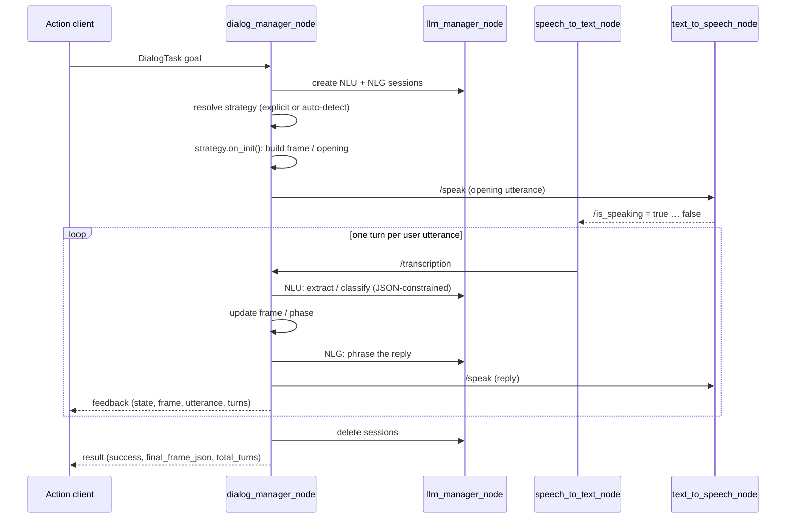
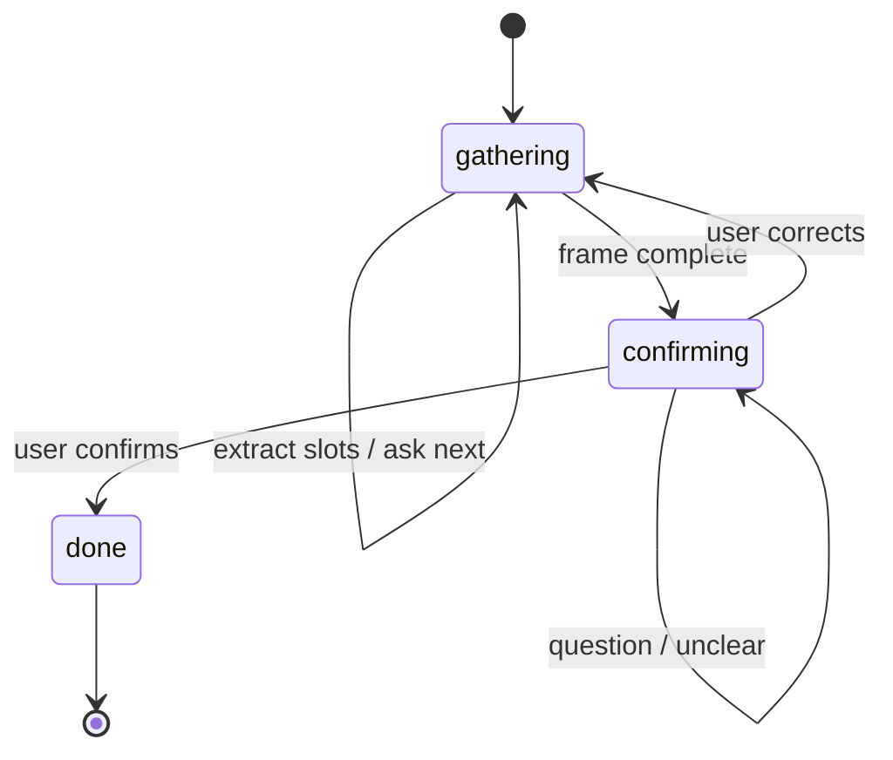

# DialoStack Architecture

This document describes how DialoStack is designed: the process topology, the dialogue engine internals, the LLM session model, and the seams where you can extend the system.

## Design philosophy

DialoStack draws a hard line between two responsibilities:

| Concern | Owner | Why |
|---------|-------|-----|
| Control flow: phases, turn limits, timeouts, confirmation, cancellation | Plain Python (FSM + strategies) | Deterministic, unit-testable, debuggable |
| Language: understanding utterances, phrasing replies | LLM (via prompt templates) | Flexible, natural, language-agnostic |

The LLM never decides *what happens next*. It only answers narrow, schema-constrained questions ("which slots does this utterance fill?", "is this a confirmation or a correction?") or generates a single utterance. Every LLM call has a timeout, bounded retries and a deterministic fallback, so a misbehaving model degrades the experience but never hangs or derails the dialogue.

A second separation keeps understanding and generation honest. Each dialogue owns **two independent LLM sessions**, one for NLU (classification and extraction, stateless, schema-constrained) and one for NLG (utterance generation). Extraction prompts never pollute the generation context, and the reverse never happens.

## Process topology

Five core nodes plus optional perception and embodiment:

| Node | Package | Role |
|------|---------|------|
| `dialog_manager_node` | ros2_dialog_manager | Orchestrator. Action server for `/dialog/execute_task` |
| `llm_manager_node` | ros2_llm_manager | LLM gateway. One node, many provider backends |
| `speech_to_text_node` | speech_io | Microphone to text (faster-whisper + Silero VAD) |
| `text_to_speech_node` | speech_io | Text to audio (Piper), action server for `/speak` |
| `emotion_detector` | vision_io | Camera to facial emotion (optional) |
| `lip_activity_detector` | vision_io | Camera to a user-speaking signal (optional) |
| `gesture_manager` / `arm_gesture_manager`, `eye_led_feedback` | robots/nao | Embodiment (optional) |

### Communication reference

**Topics**

| Topic | Type | Publisher | Subscriber | Purpose |
|-------|------|-----------|------------|---------|
| `/transcription` | `std_msgs/String` | speech_to_text_node | dialog_manager_node | Final ASR text |
| `/is_speaking` | `std_msgs/Bool` (latched) | text_to_speech_node | speech_to_text_node, gesture managers, eye_led_feedback | TTS is playing: mute mic, drive gestures and LEDs |
| `/user_vad` | `std_msgs/Float32` | speech_to_text_node | eye_led_feedback | Raw voice-activity probability [0, 1] |
| `/user_emotion` | `std_msgs/String` (JSON) | emotion_detector | dialog_manager_node | `{"emotion", "confidence", "source"}` |
| `/user_speaking` | `std_msgs/Bool` | lip_activity_detector | dialog_manager_node | Visual speaking signal (barge-in) |
| `/lip_activity` | `std_msgs/Float32` | lip_activity_detector | none | Raw lip-gap signal (debug) |
| `/target_pose` | `std_msgs/String` | any | gesture managers | Force a named pose. `"AUTO"` resumes automatic mode |

**Actions**

| Action | Type | Server | Client |
|--------|------|--------|--------|
| `/dialog/execute_task` | `DialogTask` | dialog_manager_node | your application |
| `/llm/inference` | `LlmInference` | llm_manager_node | dialog_manager_node |
| `/speak` | `SpeakText` | text_to_speech_node | dialog_manager_node |

**Services**

| Service | Type | Server | Purpose |
|---------|------|--------|---------|
| `/llm/session/create` | `CreateSession` | llm_manager_node | Open an NLU or NLG session (provider, model, system prompt, stateful flag) |
| `/llm/session/delete` | `DeleteSession` | llm_manager_node | Tear down a session |
| `/llm/session/list` | `ListSessions` | llm_manager_node | Inspect active sessions (debug) |

## Lifecycle of a dialogue



In detail:

1. **Goal received.** `dialog_manager_node` accepts a `DialogTask` goal and builds a `DialogContext` from `resources_json`, `domain` and the live user-state feed.
2. **Sessions.** Two LLM sessions are created via `/llm/session/create`, named `nlu` and `nlg`. They bind to the provider and model selected by parameters, or to the LLM node's defaults.
3. **Strategy resolution.** If `dialog_mode` is set, that strategy is built from the registry. If empty, a classification prompt picks between `slot_filling` and `explanation` (`quiz` is never auto-detected, because it requires a question bank in `resources_json`).
4. **Initialization.** The strategy's `on_init()` prepares its state. For slot filling that means obtaining a frame. It comes from `frame_schema_json` if the caller supplied one, otherwise the LLM generates it from the task description and audits it against the available resources.
5. **Turn loop.** `DialogFSM` drives `listen → strategy.on_user_turn() → speak` until the strategy reports completion, the turn budget runs out, or consecutive timeouts/unclear answers hit their limits. Cancellation (both ROS-level and spoken, e.g. *"stop, forget it"*) is checked every turn.
6. **Finalization.** Sessions are deleted, the transcript log is flushed, and the result carries `success`, `final_frame_json`, `failure_reason` and `total_turns`.

## The dialogue engine (`ros2_dialog_manager`)

```
dialog_manager_node.py     ROS shell: action server, parameters, topic plumbing
dialog_fsm.py              Turn loop: timeouts, cancellation, transcript logging
strategies/
  base.py                  Strategy contract + registry + shared cancel flow
  slot_filling.py          gathering → confirming → done
  explanation.py           explain → check understanding → rephrase (bounded)
  quiz.py                  question bank → evaluate → score
dialog_frame.py            Typed, thread-safe slot store
dialog_context.py          Static resources + live user state → [CONTEXT] block
llm_client.py              NLU/NLG facade: retries, JSON parsing, fallbacks
prompt_builder.py          prompts.yaml templates → (prompt, JSON schema)
audio_io.py                AudioIO abstraction + ROS implementation
utils.py                   ASR cleaning, normalization, loose-JSON parsing
```

### The strategy contract

A strategy is a class registered under a mode name:

```python
from ros2_dialog_manager.strategies.base import BaseDialogStrategy, register_strategy

@register_strategy("my_mode")
class MyStrategy(BaseDialogStrategy):
    def on_init(self, task: str) -> str:
        """Prepare state. Return the opening utterance."""

    def on_user_turn(self, task: str, user_text: str) -> tuple[str, bool]:
        """Process one utterance. Return (reply, done)."""

    def succeeded(self) -> bool: ...
    def current_data(self) -> dict: ...
```

The FSM knows nothing about slots, explanations or quizzes. It only calls this contract. `BaseDialogStrategy` provides the shared spoken-cancellation flow (detect the intent, ask for confirmation, then abort or resume), so every strategy gets it for free.

### Slot filling



The **DialogFrame** is the heart of this strategy: a typed slot store (`str`, `int`, `float`, `bool`, `list_str`) supporting canonical values (normalize "venti" to "large"), conditional slots (only ask for `detail_a` when `type == A`), list operations (SET/ADD/REMOVE/REPLACE), per-slot attempt tracking and full history. On each user turn the NLU session extracts operations from the utterance, the frame applies them, and the NLG session phrases an acknowledgment plus the next question. When the frame is complete the strategy switches to **confirming**, where every utterance is classified as `confirms`, `corrects`, `question` or `unclear` and handled accordingly.

### Context injection

`DialogContext` renders a `[CONTEXT]` block with the domain, the resources, and the user's current emotion (included only when notable: non-neutral, confident enough, and fresh within a TTL). `PromptBuilder` injects this block into the templates that opt in. This is how a detected frown can change the robot's tone mid-dialogue without any strategy code knowing about emotions.

### Robustness layers

- **ASR hygiene**: `clean_user_input()` filters hallucinated filler ("subtitles by...", stray punctuation) before it reaches the LLM.
- **Constrained decoding**: NLU prompts ship a JSON schema. Providers that support it (Gemini) enforce it server-side, and `parse_loose_json()` tolerates the rest.
- **Bounded retries and fallbacks**: every NLU call retries on unparseable output, then falls back to a safe deterministic answer. NLG falls back to fixed phrases in the configured language.
- **Spoken cancellation**: a fast local keyword check handles obvious cases ("stop", "cancel"). Ambiguous ones go to the LLM with a strict yes/no schema.
- **Timeout ladder**: silence triggers a re-engagement prompt. After `max_timeouts` consecutive silences the dialogue aborts gracefully.

## The LLM gateway (`ros2_llm_manager`)

One node hides every provider behind `/llm/inference` (action, with token streaming in feedback) and the session services. A **session** pins a provider, model, system prompt and statefulness. Stateful sessions keep conversation history server-side (`SessionManager`), and stateless ones are pure functions.

| Provider | Type | Streaming | Constrained JSON | Notes |
|----------|------|-----------|------------------|-------|
| Gemini (`google-genai`) | Cloud | ✅ | ✅ (`response_schema`) | Thinking disabled for predictable latency |
| Ollama | Local | ✅ | no | HTTP keep-alive pool, model pre-warming on startup |

Adding a provider means implementing `BaseProvider` (`connect`, `ensure_model_ready`, `generate`) and registering it in the node's startup. Nothing else in the stack changes.

## Speech I/O (`speech_io`)

**STT** runs three cooperating loops: a capture loop feeding 512-sample chunks into a queue, a Silero-VAD loop that segments speech into phrases (closing after `grace_period` of silence, force-closing at `max_phrase_secs`), and a faster-whisper inference loop publishing final text. While `/is_speaking` is high the node discards audio, so the robot never hears itself.

**TTS** serves the `/speak` action by piping text through Piper (`--output-raw`) and streaming the raw PCM to the audio device chunk by chunk, so speech starts before synthesis finishes. Goals are preemptable and cancellable mid-utterance (this is what makes barge-in possible), and `/is_speaking` is always lowered on exit, even on error.

## Perception (`vision_io`)

- **emotion_detector**: face detection (MediaPipe) plus a Hugging Face image-classification model, publishing `{"emotion", "confidence", "source"}` JSON on `/user_emotion`.
- **lip_activity_detector**: MediaPipe FaceLandmarker. It classifies speaking versus silent from the *variance* of lip-gap changes (speech oscillates fast, while yawns and smiles move monotonically), with onset and offset hysteresis before it flips `/user_speaking`.

Both are optional. The dialogue engine works without them and only loses the corresponding context.

## Robot embodiment (`robots/nao`)

The NAO layer consumes only generic signals (`/is_speaking`, `/user_vad`, `/target_pose`). The dialogue core has no NAO-specific code.

- **gesture_manager** (simulation) and **arm_gesture_manager** (real robot, via `nao_lola_command_msgs`) share the same logic: while the robot speaks, cycle through a pool of talking poses with randomized hold times. Otherwise they rest in listening and idle poses. Joints interpolate smoothly at 20 Hz. The real-robot variant drives arms only and republishes joint stiffness periodically.
- **eye_led_feedback** maps conversation state to eye color with smooth fades. Blue is idle, green scaled by `/user_vad` is hearing you, and pulsing warm white is speaking.
- **Pose tooling** (`pose_saver`, `pose_tester`, `gui_trigger`, `keyboard_trigger`) captures live `/joint_states` into `nao_saved_poses.yaml` and replays them in RViz. This is the workflow used to author the shipped pose library (17 poses).

Porting to another robot means re-implementing this layer for your platform's effectors.

## Extension points

| You want to… | Touch |
|--------------|-------|
| Add a dialogue mode | New strategy class and `@register_strategy`. See [the contract](#the-strategy-contract) |
| Change what the robot says | `ros2_dialog_manager/config/prompts.yaml` (no code) |
| Switch dialogue language | `language` parameter (prompts adapt, and you add fallback phrases for the new language in `llm_client.py`) |
| Add an LLM provider | Subclass `BaseProvider` in `ros2_llm_manager/providers/` |
| Use different STT/TTS | Replace the speech_io node, keep `/transcription`, `/speak`, `/is_speaking` |
| Support another robot | New package under `robots/` consuming `/is_speaking`, `/user_vad`, `/target_pose` |

## Testing & evaluation

- **Unit tests** (`ros2_dialog_manager/test/`, 173 tests) cover the deterministic core: frame semantics, strategy phase logic, context rendering and input hygiene. They use fake LLMs and need no ROS.
- **Statistical evaluation** ([`evaluation/`](../evaluation)) measures the LLM-dependent behavior per capability and end-to-end, against hand-annotated datasets, for any configured provider. Use it to compare models or validate prompt changes before deploying.
